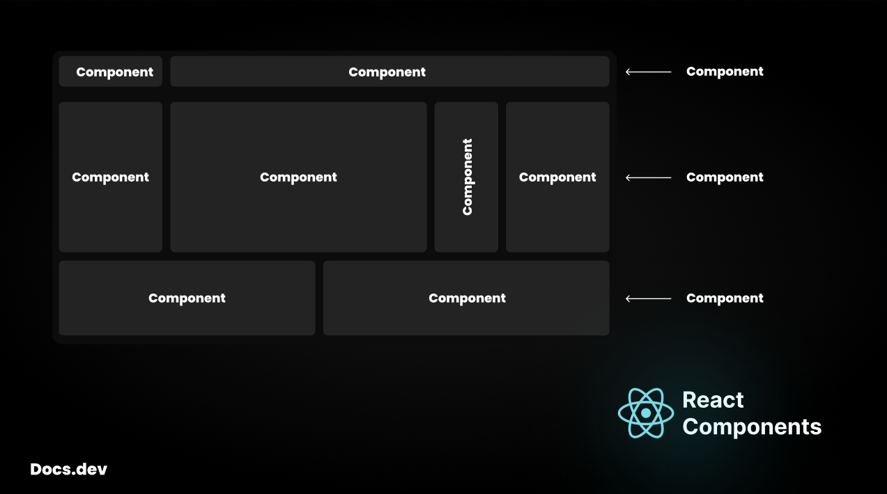

## Docs.dev - React Components and Export methods

### What is a component?
In React, a component is a reusable, self-contained block of code that defines a part of the user interface (UI).<br/>Think of components as the building blocks of a website. Each component can be as small as a button or as large as an entire page.<br/>By combining multiple components together, you can construct complex UIs.




#### Creating a component
Lets create a component as `Greet.jsx` inside the `src/components/Greet.jsx`

```jsx
import React from "react";

function Greet() {
    return <h1>Docs.dev</h1>
}

export default Greet;
```

A component is just a function which returns `JSX` code itself.
> [!IMPORTANT]\
> Component name must be in **Pascal** case i.e.,
> ```jsx
> function Greet() { ... }      // Valid component ✅
> function greet() { ... }      // Not valid component ❎
> ```

#### Rendering a component
Lets move to the `App.jsx`

```jsx
import React from "react";
import Greet from "./components/Greet.jsx";

function App() {
    return (
        <Greet />
    )
}

export default App;
```
> [!NOTE]\
> We are not going to write the all `import`, `export` and `function()` statements.
>
> Instead we will use a vscode extension
> 
> and we can snippets to write the boilers with very ease\
> `rfce` → react functional component with export

#### Nested component
Creating a small component inside a component which is only accessible within the component

Lets create another component as `src/components/ParentComponent.jsx`
```jsx
import React from "react";

function ChildComponent() {
    return <h2>Child Component</h2>
}

function ParentComponent() {
    return (
        <ChildComponent />
    )
}

export default ParentComponent;
```
`ParentComponent.jsx` has a nested component as `<ChildComponent />` which is only accessible within `ParentComponent.jsx`.<br/>
We can't access `<ChildComponent />` in another component.

### Export methods
There are two types of modular `export`s
- **default export**<br/>
    When a module is exported as default export then it can be accessible using any name from that file.<br/>
    ```js
    // methods.js

    const currentDate = () => {
        // code...
    }

    export default currentDate;
    ```

    Accessing the module using default export
    ```jsx
    // App.jsx

    import React from "react";
    import currentDate from "methods.js";

    function App() {
        const getDate = () => {
            const getDate = currentDate()
            console.log(getDate)
        }
        getDate()

        return (
            <div>
                Docs.dev
            </div>
        )
    }
    ```
> [!NOTE]\
> Instead of `currentDate` we can import as
> ```jsx
> import dateFunction from "methods.js";
> ```
> or whatever we want to call this method.
- **named export**<br/>
    When a module is exported as named export then it can only be accessible by its exact name.<br/>
    ```js
    // methods.js

    const currentDate = () => {
        // Code...
    }

    export { currentDate }
    ```

    Accessing the module using named export
    ```js
    // App.jsx

    import React from "react";
    import { currentDate } from "methods.js";

    function App() {
        const getDate = () => {
            const getDate = currentDate()
            console.log(getDate)
        }
        getDate()

        return (
            <div>
                Docs.dev
            </div>
        )
    }
    ```
> [!NOTE]\
> We can write the named export module as
> ```js
> export const currentDate = () => {
>     // Code...
> }
> ```